# Jan Rogowski Julian Kulikowski Michał Węsiora 

# Dokumentacja do „Implementacja aplikacji szyfrującej i deszyfrującej pliki z wykorzystaniem kryptografii symetrycznej”.

\
## 1.  Instrukcja obsługi aplikacji

Aplikacja stanowi demonstrację mechanizmu szyfrowania i deszyfrowania plików przy pomocy algorytmu blokowego AES w języku C#. Udostępnia ona kilka podstawowych trybów tego algorytmu: ECB, CBC, CFB, CTR. Poprzez szyfrowanie zdjęć pokazuje ona działanie tych trybów, ich cechy i umożliwia zaobserwowanie skutków przekłamań pikseli lub wektora IV dla każdego z kilku obsługiwanych trybów AES.

Przy pomocy przycisku „Select Image” wybieramy zdjęcie do zaszyfrowania.

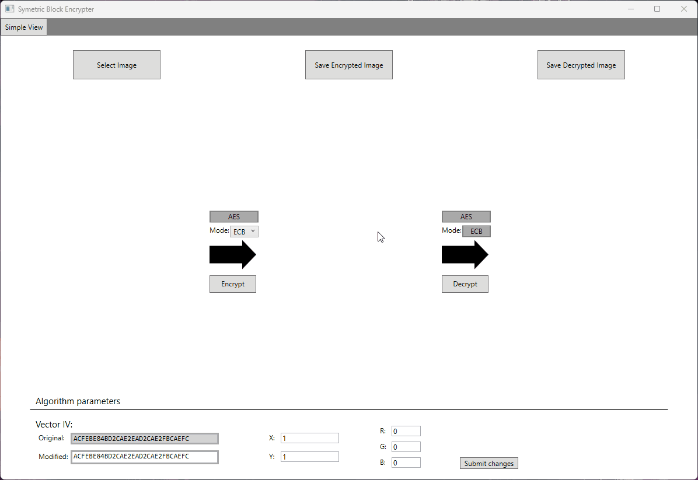

Wybieramy tryb szyfrowania blokowego i po naciśnięciu przycisku „Encrypt” szyfrujemy, a po naciśnięciu przycisku „Decrypt” odszyfrowujemy plik.

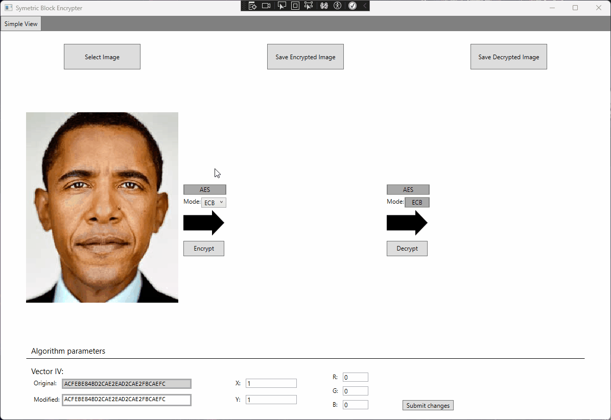

Aby zapisać zdjęcie na dysku wybieramy przycisk „Save Encrypted Image” albo „Save Decrypted Image”

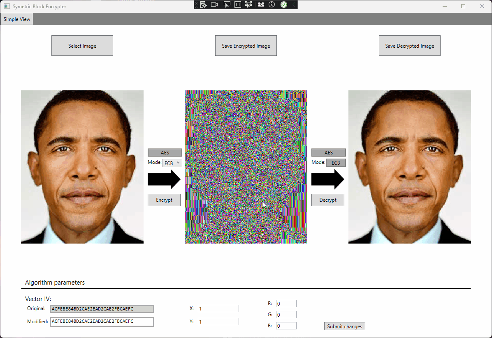

Aplikacja umożliwia również modyfikację wektora IV w celu symulowania przekłamania. Aby dokonać modyfikacji należy najechać na pole tekstowe w lewym dolnym rogu i zmienić wartości szesnastkowe. Zmieniony wektor zostanie automatycznie wykorzystany do odszyfrowania.

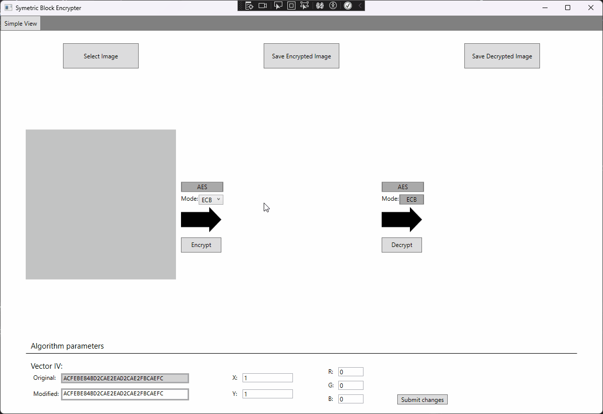

Możemy również dokonać modyfikacji (przekłamania) wybranego piksela poprzez wybranie pozycji (X, Y) w polach tekstowych, składowych RGB piksela i następnie zatwierdzenie zmian przyciskiem „Submit changes”.

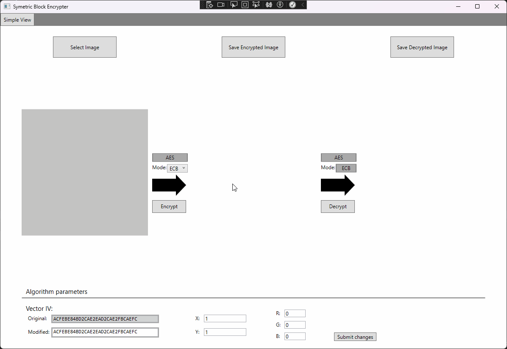

\
## 2.  Implementacja AES

Algorytm AES zaimplementowany został w naszej aplikacji przy pomocy
biblioteki System.Security.Cryptography. Poniżej przedstawiamy kawałki
kodu odpowiadające za realizację tego algorytmu.

- Inicjalizacja AES

> 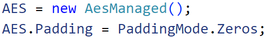 alt="A blue and black text Description automatically generated" />

- Ustawienie klucza szyfrującego

> 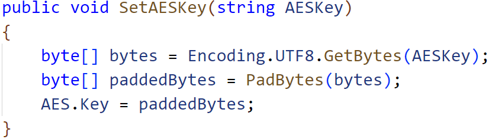 alt="A computer code with blue text Description automatically generated" />

- Ustawienie wektora inicjującego IV (dla trybów CBC, CFB, CTR)

> 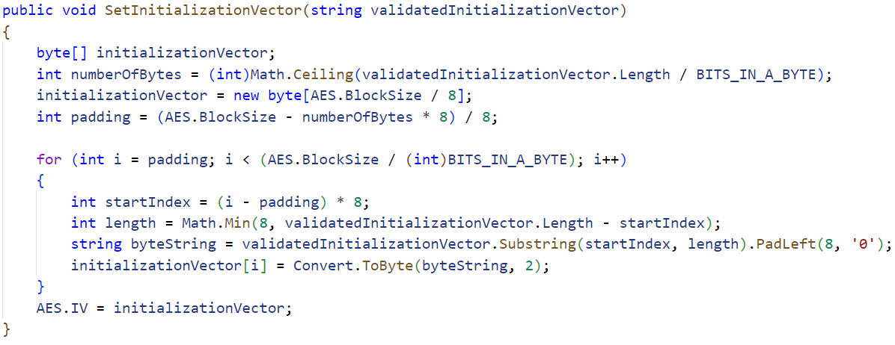 alt="A computer code with text Description automatically generated" />

- Implementacja trybu ECB

> 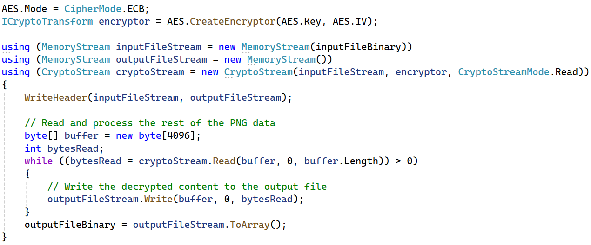 alt="A screen shot of a computer code Description automatically generated" />

- Implementacja trybu CBC

- Implementacja trybu CFB

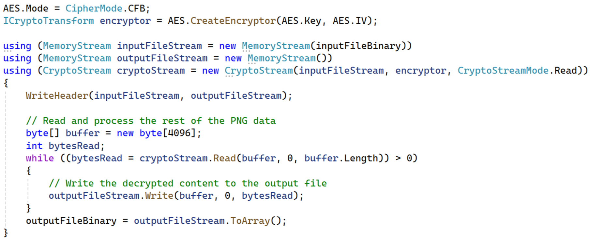

- Implementacja trybu CTR

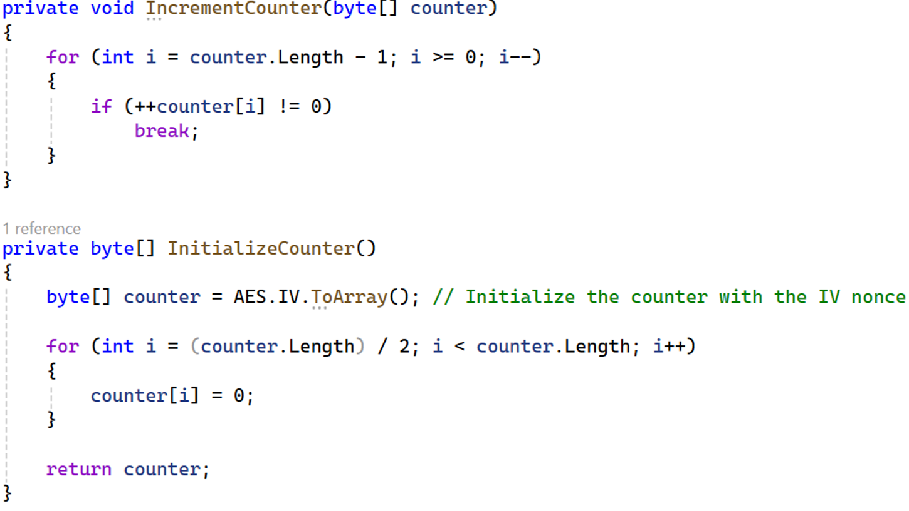

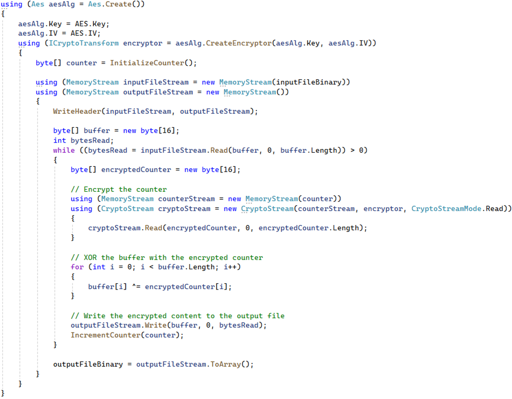
